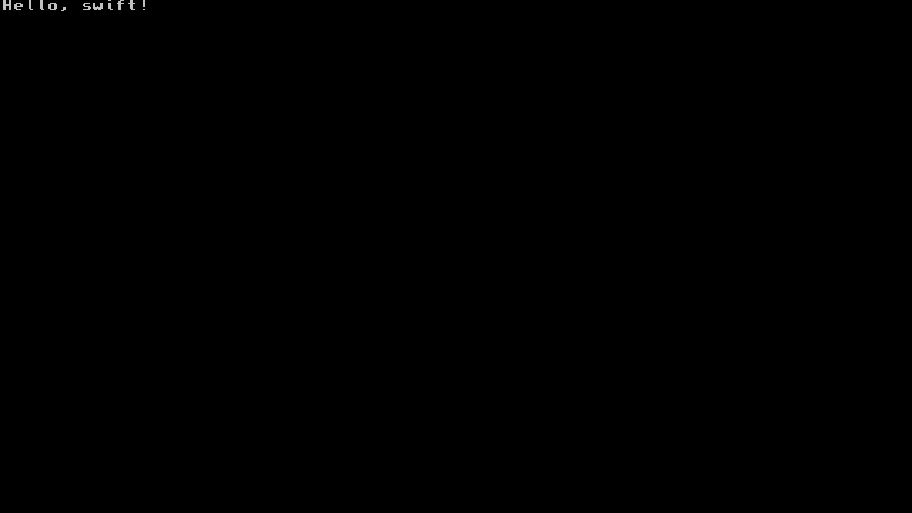

# SwiftNX
Swift homebrew running on the Nintendo Switch!

## Currently Working
- Swift entry point: `swift_main() -> Int`
- Specific [libnx](https://github.com/switchbrew/libnx) C function calls (**applet, gfx, console**)

## Project Goals
- Importable swiftnx homebrew module
- Wrapper classes over common [libnx](https://github.com/switchbrew/libnx) API's
    - NXDevice
    - NXApplet
    - NXConsole
    - NXGfx
    - NXInput
    - etc..
- [SDL2](https://www.libsdl.org/index.php) wrapper classes
    - SDLWindow
    - SDLRenderer
    - SDLRect
    - etc..
- UI framework built on [SDL2](https://www.libsdl.org/index.php)
    - NXUIWindow
    - NXUIView
    - NXUIRect
    - NXUILabel
    - NXUIButton
    - NXUIAlert
    - etc..

### Example

```swift
@_silgen_name("swift_main")
func swift_main() -> Int {

    gfxInitDefault()

    var console = PrintConsole()
    consoleInit(&console)
    consoleSelect(&console)
    printf("Hello, swift!")

    while(appletMainLoop()) {

        gfxFlushBuffers()
        gfxSwapBuffers()
        gfxWaitForVsync()

    }

    gfxExit()
    return 0

}
```


## Contributing
This is a big (but fun!) project. Any help is more than welcome / appreciated 😊🤘🏻.
