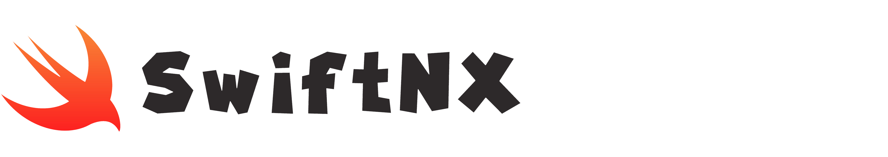

## Overview
Swift homebrew framework for the Nintendo Switch!

### *What Currently Works*
- Swift entry point: `swift_main() -> Int`
- Specific [libnx](https://github.com/switchbrew/libnx) C function calls (**applet, gfx, console**)

### Project Goals
- Importable `swiftnx` Swift module
- nxlink support (nro loading without fumbling with SD cards)
- Wrapper classes over common [libnx](https://github.com/switchbrew/libnx) API's
    - `NXDevice`
    - `NXApplet`
    - `NXConsole`
    - `NXGfx`
    - `NXInput`
    - **etc..**
- UI framework built on [SDL2](https://www.libsdl.org/index.php)
    - `NXUIWindow`
    - `NXUIView`
    - `NXUIRect`
    - `NXUILabel`
    - `NXUIButton`
    - `NXUIAlert`
    - **etc..**

#### Example

```swift
@_silgen_name("swift_main")
func swift_main() -> Int {

    gfxInitDefault()

    var console = PrintConsole()
    consoleInit(&console)
    consoleSelect(&console)
    printf("Hello, swift!")

    while(appletMainLoop()) {

        gfxFlushBuffers()
        gfxSwapBuffers()
        gfxWaitForVsync()

    }

    gfxExit()
    return 0

}
```


## Contributing
This is a big (but fun!) project. Any help is more than welcome / appreciated 😊🤘🏻.
